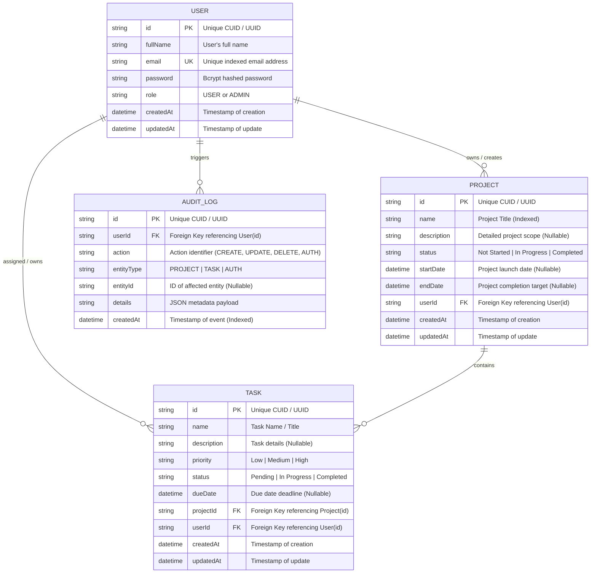

# Database Schema & Entity Relationship (ER) Documentation

This document describes the relational database structure, entity models, constraints, and relationships for the **Project Management System**.

---

## 1. Entity Relationship Diagram (ERD)

---

## 2. Table Specifications & Constraints

### 2.1 `User` Table
| Column | Type | Nullable | Default | Constraints / Notes |
| :--- | :--- | :--- | :--- | :--- |
| `id` | `VARCHAR(36)` | NO | `CUID()` | Primary Key |
| `fullName` | `VARCHAR(100)` | NO | - | User display name |
| `email` | `VARCHAR(255)` | NO | - | **UNIQUE**, Indexed, lowercased |
| `password` | `VARCHAR(255)` | NO | - | Bcrypt hashed with salt (12 rounds) |
| `role` | `VARCHAR(20)` | NO | `'USER'` | Access role (`USER`, `ADMIN`) |
| `createdAt` | `DATETIME` | NO | `CURRENT_TIMESTAMP` | Audit timestamp |
| `updatedAt` | `DATETIME` | NO | `CURRENT_TIMESTAMP` | Updated automatically |

---

### 2.2 `Project` Table
| Column | Type | Nullable | Default | Constraints / Notes |
| :--- | :--- | :--- | :--- | :--- |
| `id` | `VARCHAR(36)` | NO | `CUID()` | Primary Key |
| `name` | `VARCHAR(150)` | NO | - | Indexed for fast search queries |
| `description` | `TEXT` | YES | `NULL` | Rich project description |
| `status` | `VARCHAR(30)` | NO | `'Not Started'` | Enum: `Not Started`, `In Progress`, `Completed` |
| `startDate` | `DATETIME` | YES | `NULL` | Start timestamp |
| `endDate` | `DATETIME` | YES | `NULL` | Target deadline |
| `userId` | `VARCHAR(36)` | NO | - | **Foreign Key** `User(id)`, `ON DELETE CASCADE` |
| `createdAt` | `DATETIME` | NO | `CURRENT_TIMESTAMP` | Indexed sorting |
| `updatedAt` | `DATETIME` | NO | `CURRENT_TIMESTAMP` | Updated automatically |

---

### 2.3 `Task` Table
| Column | Type | Nullable | Default | Constraints / Notes |
| :--- | :--- | :--- | :--- | :--- |
| `id` | `VARCHAR(36)` | NO | `CUID()` | Primary Key |
| `name` | `VARCHAR(150)` | NO | - | Task summary |
| `description` | `TEXT` | YES | `NULL` | Sub-task / requirements details |
| `priority` | `VARCHAR(20)` | NO | `'Medium'` | Enum: `Low`, `Medium`, `High` |
| `status` | `VARCHAR(30)` | NO | `'Pending'` | Enum: `Pending`, `In Progress`, `Completed` |
| `dueDate` | `DATETIME` | YES | `NULL` | Target due date |
| `projectId` | `VARCHAR(36)` | NO | - | **Foreign Key** `Project(id)`, `ON DELETE CASCADE` |
| `userId` | `VARCHAR(36)` | NO | - | **Foreign Key** `User(id)`, `ON DELETE CASCADE` |
| `createdAt` | `DATETIME` | NO | `CURRENT_TIMESTAMP` | Audit timestamp |
| `updatedAt` | `DATETIME` | NO | `CURRENT_TIMESTAMP` | Updated automatically |

---

### 2.4 `AuditLog` Table
| Column | Type | Nullable | Default | Constraints / Notes |
| :--- | :--- | :--- | :--- | :--- |
| `id` | `VARCHAR(36)` | NO | `CUID()` | Primary Key |
| `userId` | `VARCHAR(36)` | NO | - | **Foreign Key** `User(id)`, `ON DELETE CASCADE` |
| `action` | `VARCHAR(50)` | NO | - | Event identifier |
| `entityType` | `VARCHAR(30)` | NO | - | Entity classification |
| `entityId` | `VARCHAR(36)` | YES | `NULL` | Reference ID |
| `details` | `TEXT` | YES | `NULL` | Serialized JSON event parameters |
| `createdAt` | `DATETIME` | NO | `CURRENT_TIMESTAMP` | Indexed chronological trace |

---

## 3. Relational Integrity & Data Isolation Principles
1. **Foreign Key Cascading**: Deleting a project automatically deletes its associated tasks (`onDelete: Cascade`), preventing orphaned database rows.
2. **User Isolation**: Every database query on `Project` and `Task` filters by `userId` to guarantee that users cannot view, modify, or delete entities belonging to another user.
3. **Parameterized Queries**: All database queries are executed via Prisma ORM parameterized statements, eliminating SQL Injection vulnerabilities.
